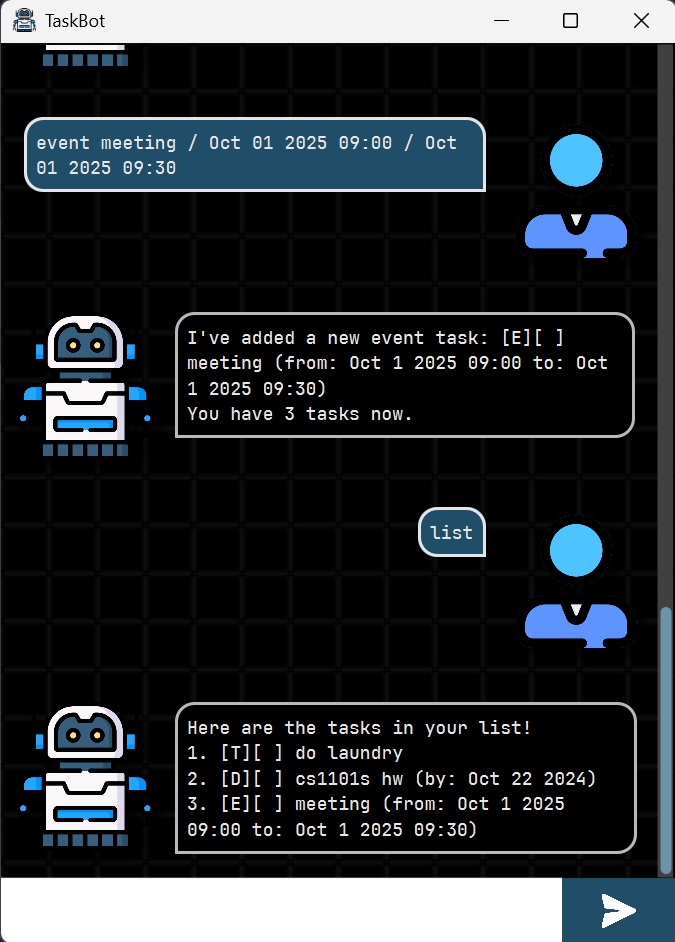

# TaskBot

TaskBot is a desktop application for managing your tasks efficiently. 
It allows you to add, delete, mark, unmark, and find tasks with ease.

### Table of Contents
- [Quickstart](#quickstart)
- [Features](#features)
- - [Adding a todo: `todo`](#adding-a-todo-todo)
- - [Adding a deadline: `deadline`](#adding-a-deadline-deadline)
- - [Adding an event: `event`](#adding-an-event-event)
- - [Listing all tasks: `list`](#listing-all-tasks-list)
- - [Marking a task as done: `mark`](#marking-a-task-as-done-mark)
- - [Unmarking a task as not done: `unmark`](#unmarking-a-task-as-not-done-unmark)
- - [Deleting a task: `delete`](#deleting-a-task-delete)
- - [Finding tasks by keyword: `find`](#finding-tasks-by-keyword-find)
- - [Sorting tasks by type: `sort`](#sorting-tasks-by-type-sort)
- - [Saving tasks to file: `save`](#saving-tasks-to-file-save)
- - [Exiting the program: `bye`](#exiting-the-program-bye)  

 

-------------------

## Quickstart
1. Ensure you have Java 17 installed. 
You can download it from [here](https://www.oracle.com/java/technologies/javase/jdk17-archive-downloads.html).
2. Head to [the site of my fork](https://github.com/salmonkarp/ip).
3. Go to the Releases section
4. Download the .jar file
5. Put it into an empty folder, and run by clicking it or running `java -jar "taskBot.jar"` in a terminal.
6. Refer to the features section below for usage.

Alternatively, you can also clone the repo and build it yourself:
``
git clone https://github.com/salmonkarp/ip.git
``
Then, navigate to the project directory and run:
``
./gradlew run
``
# Features

## Adding a todo: `todo`
Adds a todo task to the list. A todo task only has a description.
A description can be any string, which will be trimmed by TaskBot.
By default, a newly added task is not done.

Format: `todo DESCRIPTION`

Example: `todo read book`

## Adding a deadline: `deadline`
Adds a deadline task to the list. 
A deadline task has a description and a time by which it should be done.
By default, a newly added task is not done.

Format: `deadline DESCRIPTION / TIME`

The time can be in the following formats:
- `YYYY-MM-DD HH:MM`
- `YYYY-MM-DD`
- `MMM DD YYYY HH:MM`
- `MMM DD YYYY`

Examples: 
- `deadline return book / 2025-09-15 18:00`
- `deadline submit report / 2025-09-15`
- `deadline module homework / Jun 13 2025`
- `deadline send mail / Jun 13 2025 09:30`

## Adding an event: `event`
Adds an event task to the list. 
An event task has a description, a start time, and an end time.
By default, a newly added task is not done.

Format: `event DESCRIPTION / START_TIME / END_TIME`

The time can be in the following formats:
- `YYYY-MM-DD HH:MM`
- `YYYY-MM-DD`
- `MMM DD YYYY HH:MM`
- `MMM DD YYYY`

Examples:
- `event project meeting / 2025-09-15 14:00 / 2025-09-15 16:00`
- `event teaching session / 2025-09-15 / 2025-09-15`
- `event lecture / Jun 13 2025 14:00 / Jun 13 2025 16:00`
- `event tutorial / Jun 13 2025 / Jun 14 2025`

## Listing all tasks: `list`
Lists all tasks in the list. 
The tasks will be displayed in the order they were added, assuming no sorting has been applied.
  
All the corresponding user-controllable details of each task will be displayed, e.g.
- Index number
- Task type (Todo[T], Deadline[D], or Event[E])
- Status (done or not done)
- Description
- Time (if applicable)

## Marking a task as done: `mark`
Marks a task as done. The index refers to the index number shown in the `list` command.
  
Marked tasks will be shown with a cross ([X]) symbol.
Already-marked tasks will remain marked.

Format: `mark INDEX`

Example: `mark 2`

## Unmarking a task as not done: `unmark`
Marks a task as not done. The index refers to the index number shown in the `list` command.
  
Unmarked tasks will be shown with an empty bracket ([ ]) symbol.
Already-unmarked tasks will remain unmarked.

Format: `unmark INDEX`

Example: `unmark 2`

## Deleting a task: `delete`
Deletes a task from the list. The index refers to the index number shown in the `list` command.
  
Deleted tasks will be permanently removed from the list.
> Note: Indexes of tasks may change after deletion.
> Make sure to use the `list` command to check the current indexes of tasks.

Format: `delete INDEX`

Example: `delete 2`

## Finding tasks by keyword: `find`
Finds tasks that contain the given keyword. The search is case-insensitive.
  
Partial matches will be returned. 
For example, searching for "book" will return tasks with descriptions like "read book" and "book flight".

Format: `find KEYWORD`

Example: `find book`

## Sorting tasks by type: `sort`
Sorts tasks by specific parameters.

Format: `sort [PARAMETER]`

Possible parameters:
- `alphabetical`: Sorts tasks in alphabetical order by description.
- `time_created`: Sorts tasks by the time they were created (oldest to newest).
- `deadline`: Sorts tasks by their deadlines (earliest to latest). Event tasks will use their start time. 
Tasks without deadlines are listed at the end.
- `is_done`: Sorts tasks by their completion status (not done first, then done).

Example: `sort deadline`

## Saving tasks to file: `save`
Saves the current list of tasks to a local file. 
By default, the file is named `tasks.txt` and stored in the directory `./data`.

## Exiting the program: `bye`
Exits the program. Tasks will be saved automatically before exiting.
Similar behaviour occurs when you manually close the application using the GUI.

> This is an individual project for CS2103T 25/26 S1.

_Last updated on 18/9/2025_

